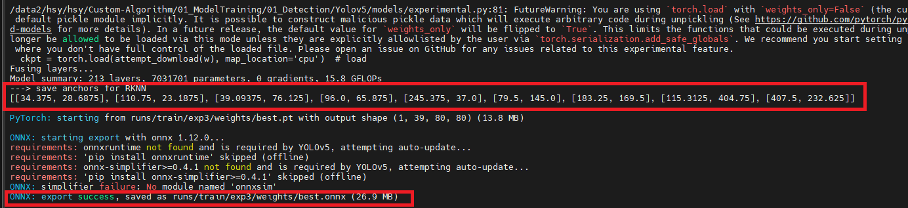

# Yolov5

## 环境安装

1. Clone repo and install [requirements.txt](requirements.txt) in a python=3.8.0 environment, including pytorch>=1.8

   ```
   git clone https://github.com/AIDrive-Research/Custom-Algorithm.git
   cd Custom-Algorithm/01_ModelTraining/01_Detection/Yolov5  
   ```

2. 根据cuda版本安装pytorch-v2.5.1  
   参考：https://pytorch.org/get-started/previous-versions/  
   以cuda 11.8为例：
   ```
   pip install torch==2.5.1 torchvision==0.20.1 torchaudio==2.5.1 --index-url https://download.pytorch.org/whl/cu118 
   ```

3. 安装依赖
   ```
   pip install -r requirements.txt -i https://pypi.tuna.tsinghua.edu.cn/simple/
   ```

## 数据准备

1. 制作VOC格式数据集，目录结构如下。

   ```
    JPEGImages:
    	xxx.jpg
    Annotations:
    	xxx.xml
   ```

2. 将VOC格式数据集转换成YOLO格式

   修改tools/0_xml2txt.py：

   - CLASSES：目标类别
   - XML_DIR：VOC标注文件路径
   - JPEG_DIR：图片文件路径
   - LABEL_DIR：YOLO格式标注文件存储路径

   ```
    python tools/0_xml2txt.py
   ```

3. 将YOLO格式数据拆分训练集和验证集

   ```
    python tools/1_split_train_val.py --input-images 图片文件路径 --input-labels YOLO格式标注文件存储路径 --output YOLO数据集存储路径
   ```

   YOLO格式数据结构如下图:

   ```
    images:
    	train
    		xxx.jpg
    	val
    		xxx.jpg
    labels:
    	train
    		xxx.txt
    	val
    		xxx.txt	
   ```

4. 新建训练数据yaml文件，参考data/coco128.yaml编辑自己的yaml文件

   ```
    cd data
    cp coco128.yaml custom.yaml
   ```

   修改custom.yaml:

   - path: YOLO数据集存储路径, 如：output/yolo
   - train: images/train
   - val: image/val
   - nc: 类别数目
   - names: 类别名称，此处与2中CLASSES相同

## 训练

下载预训练权重：[./yolov5s.pt](https://pan.baidu.com/s/1eGCl5q809TVYe8vh7heh3A?pwd=0000)

1. 单卡训练

   ```
    python train.py --data data/custom.yaml --epochs 300 --weights '' --cfg models/yolov5s.yaml --batch-size 32 --device 0
   ```

   如果使用预训练

   ```
    python train.py --data data/custom.yaml --epochs 300 --weights yolov5s.pt --batch-size 32 --device 0
   ```

2. 推荐使用多卡训练

   ```
    python -m torch.distributed.run --nproc_per_node 2 train.py --batch 32 --data data/custom.yaml --weights yolov5s.pt --device 0,1
   ```
注意：batch-size根据显存情况调整。

## 模型路径
训练后模型保存路径由`train.py`中`project`参数和`name`参数指定。
默认值：
```
project = runs/train
name = exp
```
若使用默认值，模型保存在`runs/train`文件夹下，以`exp`命名。
若多次运行，会生成`exp`、`exp2`、`exp3`等文件夹，选择训练成功的模型文件`best.pt` 。

## 模型导出
1. ONNX导出

   ```
   python export_rk.py --weights xxx.pt --include onnx --simplify --opset 12 --rknpu rk3588
   ```
导出过程如下图：


- 记录模型的anchors
   - 通用anchors: [[10, 13], [16, 30], [33, 23], [30, 61], [62, 45], [59, 119], [116, 90], [156, 198], [373, 326]]
   - 若打印的anchors与通用anchors不同，此处需记录anchors值，在制作算法包时修改配置文件。
- onnx模型的生成路径


## 模型量化
**注意**：该操作适用于ks968产品，ks988无需执行。

1. [**环境安装**](../../README.md)

2. 在训练集中随机选取图片进行模型量化，精度校准，数量在80-120之间，目录结构如下：

   ```
    images:
    	xxx.jpg
   ```

3. 把图片路径保存至xxx.txt

   ```
    find ./images/ -name "*.jpg">custom.txt
   ```

4. 模型量化

   修改convert.py：

   - DATASET_PATH：量化图片路径

   运行：

   ```
    python convert.py onnx_model_path platform i8/fp output_rknn_path
   ```

   其中：

   - onnx_model_path：训练后导出的onnx模型文件位置
   - platform：rk3588
   - i8/fp：i8代表使用图片量化；fp代表不量化
   - output_rknn_path：量化后模型的保存路径

