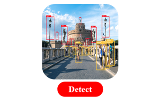
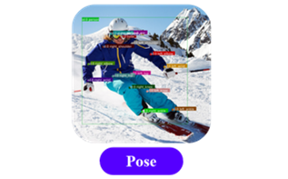
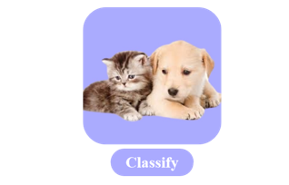
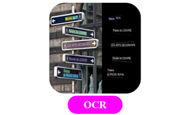
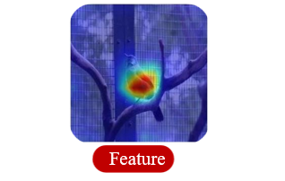

# ModelTraining

## 🌟环境安装

### 训练环境
- 训练环境安装请参考选定模型的文件夹内部说明文档，如Yolov5/README.md。

### 量化环境
注意：该流程适用于晓知精灵**ks968**产品，ks988无需执行。

- 系统要求
    - 操作系统：Ubuntu

- Tools/rknn-toolkit2中提供了python3.8的量化环境whl文件

  ```bash
    cd Tools/rknn-toolkit2
    conda create -n py38-rk2.2 python=3.8
    conda activate py38-rk2.2
    pip3 install rknn_toolkit2-2.2.0-cp38-cp38-manylinux_2_17_x86_64.manylinux2014_x86_64.whl
  ```

## 数据标注

### 标注工具

- 目标检测标注工具：[链接](https://pan.baidu.com/s/1PvFf5yUyW1jwhyiDWbFDEg?pwd=0000)
- 姿态&分割标注工具：[链接](https://pan.baidu.com/s/1PXnlpoZxmtK1cThaFEj1vg?pwd=0000)
- OCR标注工具：[链接](https://pan.baidu.com/s/1UudJGGLMBX0vWYn7JAYB0g?pwd=0000)

### 标注样例

| [**目标检测**](https://pan.baidu.com/s/1luEjFr8_SHCRHhJFSkqjcA?pwd=0000) | [**实例分割**](https://pan.baidu.com/s/1fCIEHnce3V48h6ZZtKhq0A?pwd=0000) | [**姿态检测**](https://pan.baidu.com/s/1k5FKOWfKoInTKOEuuh8uLg?pwd=0000) |
| :----------------------------------------------------------: | :----------------------------------------------------------: | :----------------------------------------------------------: |
|                         |                       |                             |
| [**图像分类**](https://pan.baidu.com/s/1heYpj7qgexHhIaQQ8_pDEA?pwd=0000) | [**字符识别**](https://pan.baidu.com/s/1Z9h46BJiRKqI_MKYUeoPLg?pwd=0000) | [**特征提取**](https://pan.baidu.com/s/1PHuvWME52MbeCgF3MvXTZQ?pwd=0000 ) |
|                         |                               |                           |

## 模型训练

提供5大类5种模型训练方法。模型输入：数据集+预训练模型（可选），输出：onnx格式权重。提供数据集[标注工具](#标注工具)与[标注样例](#标注样例)，可参考标注数据集。

|                          目标检测 🚀                          |                          实例分割⭐                           |                           姿态检测                           |                           图像分类                           |                           字符识别                           |
| :----------------------------------------------------------: | :----------------------------------------------------------: | :----------------------------------------------------------: | :----------------------------------------------------------: | :----------------------------------------------------------: |
| 提供yolov5-6.2版本模型训练方法，快速训练专有检测模型。<br>[预训练权重](https://pan.baidu.com/s/1eGCl5q809TVYe8vh7heh3A?pwd=0000)<br>[训练方法](./01_Detection/Yolov5/README.md) | 提供yolov5-seg-7.0版本模型训练方法，快速训练专有分割模型。<br>[预训练权重](https://pan.baidu.com/s/11XLNJquvQB8zvBla9XhXpA?pwd=0000)<br>[训练方法](./03_Segmentation/Yolov5-seg/README.md) | 提供yolov8-pose-8.1版本模型训练方法，快速训练专有姿态模型。<br>[预训练权重](https://pan.baidu.com/s/1tsMtCUsilnOUZTt-kD--XA?pwd=0000)<br>[训练方法](./05_Pose/Yolov8-pose/README.md) | 提供resnet-18模型训练方法，快速训练专有分类模型。<br>[训练方法](./02_Classification/Resnet18/README.md) | 提供paddleocr模型训练方法，快速训练字符识别专有模型。<br>[训练方法](./04_OCR/PaddleOCR/README.md) |