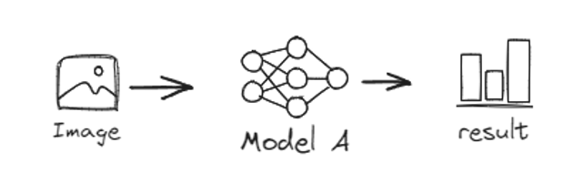
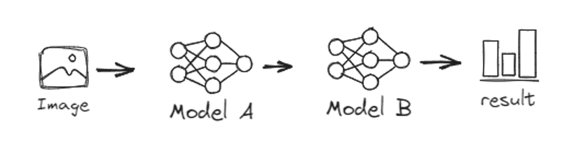
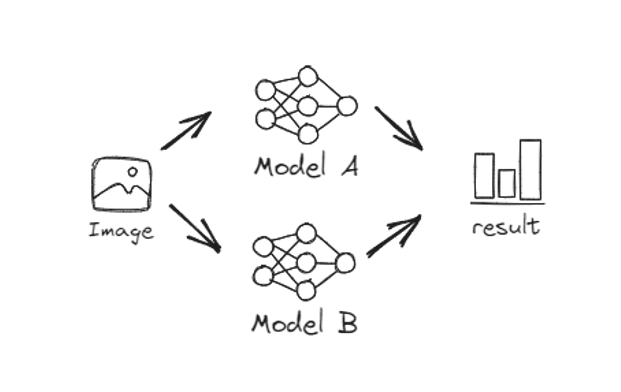
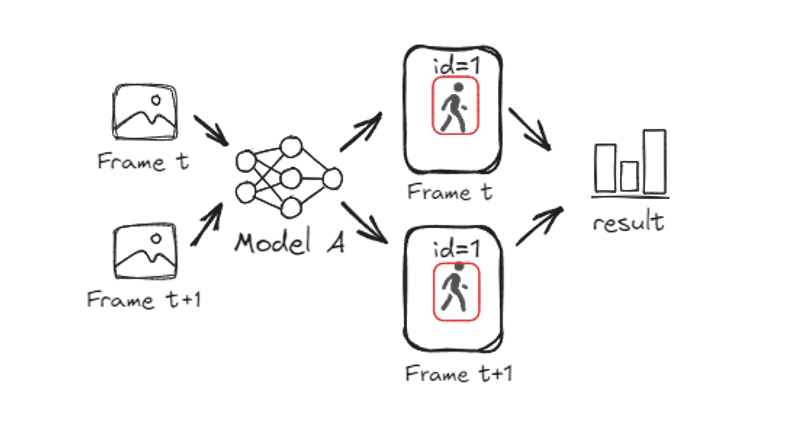
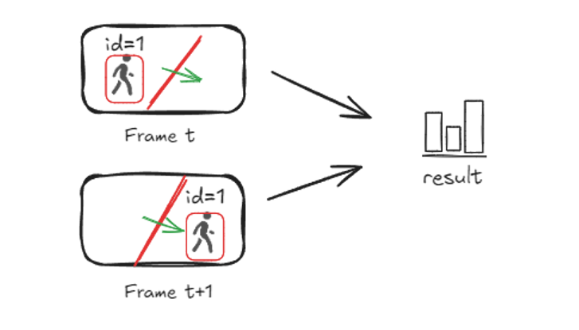
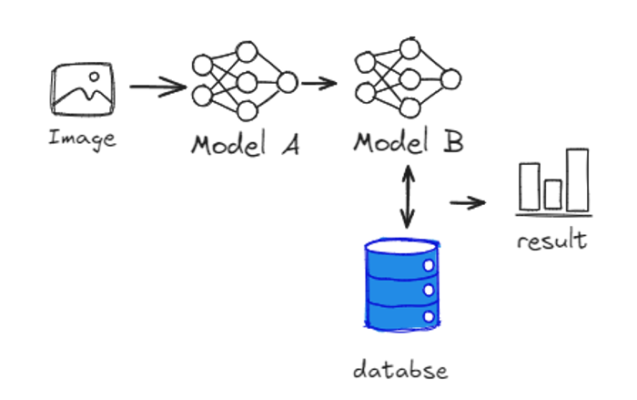

# 01_Examples

## 开发样例

教程提供了八种算法包样例，用户可根据需求，参照相应样例，开发专有算法包。

|                             类型                             |                             介绍                             |                   参考样例                   |                          
| :----------------------------------------------------------: | :----------------------------------------------------------: | ------------------------------------------------------------ |
| 快速入门类  | 单模型目标检测算法。无需编写代码，替换为自有模型，修改配置即可使用。 |     [样例](./quick_start/README.md)      |
| 目标检测类  | 单模型目标检测算法。如区域入侵、离岗检测、车型检测等。业务逻辑简单，使用最广泛。 |   [样例](./object_detection/README.md)   |
| 模型级联类  | 模型A的输出作为模型B的输入，算法基于模型B的输出决策。如未佩戴安全帽检测、抽烟检测、使用手机检测等。 |   [样例](./model_cascading/README.md)    | 
| 模型并联类   | 算法基于模型A/B的并行化输出决策。如未穿戴反光衣检测、挂钩高挂低用检测等。 |  [样例](./model_parallelism/README.md)   |
| 目标跟踪类  | 算法基于同一目标在多帧下的坐标或时间数据决策。如徘徊检测、睡岗检测等。 |   [样例](./object_tracking/README.md)    | 
| 目标计数类  | 算法基于跟踪数据与预设直线数据决策。如人员计数、车辆计数等。 |   [样例](./object_counting/README.md)    | 
| 底库比对类  | 算法基于在线图像或目标特征与底库特征数据比对决策。如人脸识别、未穿工服检测、消防通道占用检测等。 | [样例](./base_lib_comparision/README.md) | 
| 图像分类类  |       图像分类算法。如雨雾识别、矿石颗粒度等级检测等。       | [样例](./image_classification/README.md) | 