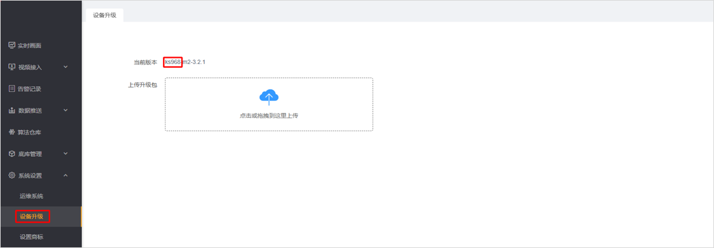
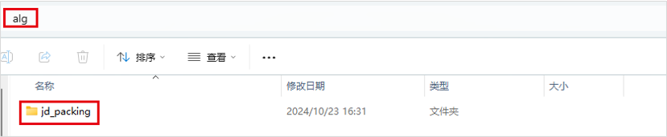
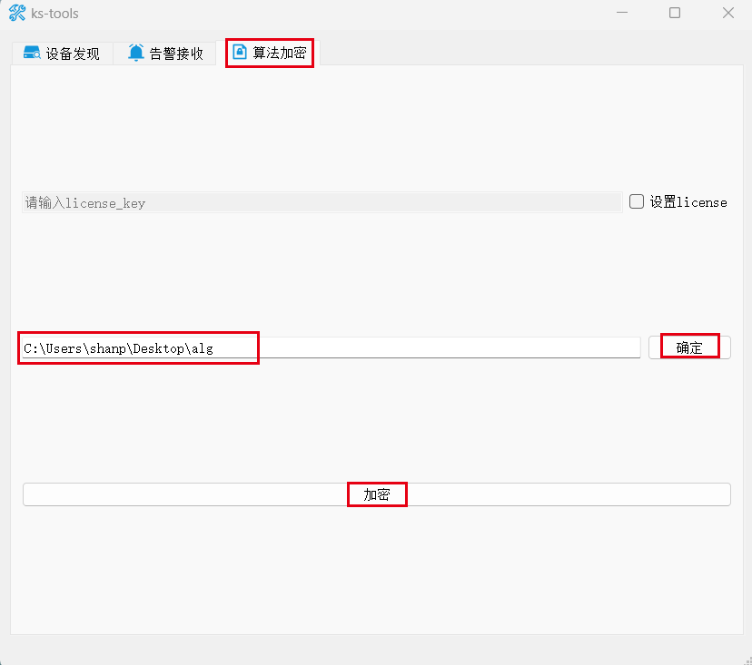
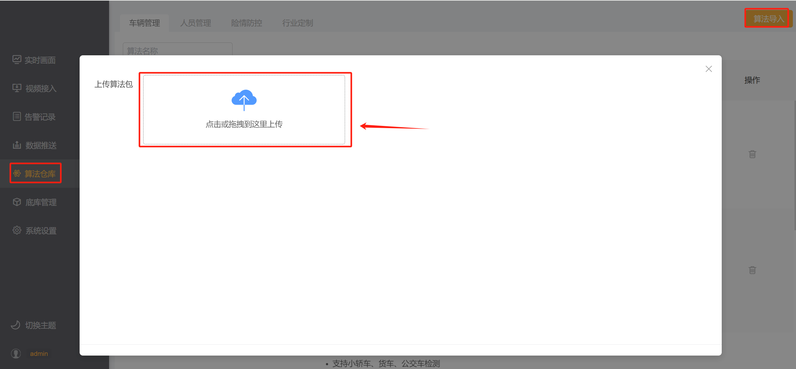
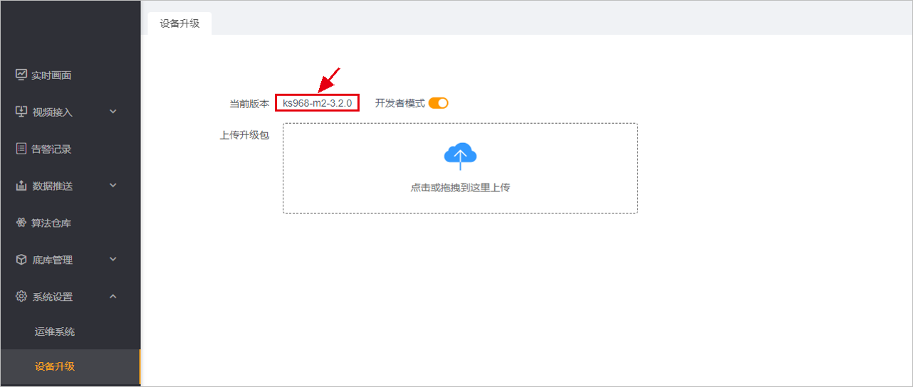
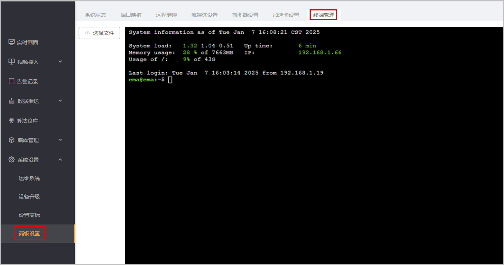

# object_detection_integrated_with_face_recognition

## 1. 下载示例算法包

```
git clone https://github.com/AIDrive-Research/Custom-Algorithm.git
```

下载示例算法包，并在示例算法包上修改。

- 如果产品型号为ks968，则在ks968下的 [face_linked_play_phone](./ks968/face_linked_play_phone) 算法包上修改。
- 如果产品型号为ks988，则在ks988下的 [face_linked_play_phone](./ks988/face_linked_play_phone) 算法包上修改。
- 可以直接导入 `face_linked_play_phone.bin` 测试算法功能。

产品型号查看，产品型号在【系统设置】-【设备升级】中可查看。



## 2. 算法逻辑
- 检测人体，检测人脸、人脸质量、提取人脸特征；
- 裁剪人体区域，二次推理检测手机；
- 逻辑判断，若检测到人体使用手机，将人脸与底库对比；
- 若识别到底库人脸，返回使用手机告警，携带人脸识别信息；
- 若未识别到底库人脸，仅返回使用手机告警。

## 3. 算法包加密&导入

- 将算法包加密为bin文件。下载算法包[加密工具](../../../Tools/ks-tools/ks-tools.zip)。将待加密算法包放在文件夹内（文件夹只含单个算法包），填写待加密算法包的上级路径（如下述文件夹所示），点击【确定】按钮，提示即将加密的算法包名称，点击【ok】；





- 加密完成的bin文件为最终文件，从盒子后台管理系统【算法仓库】中导入即可。 



## 3. 代码调试

- 在下图所示红色框内，连续点击7次，打开开发者模式



- 在高级设置，终端管理中，可进入盒子后台调试&查看日志（请勿删除系统源码，谨慎操作，否则造成设备不可用）



- 调试代码。导入`logger`包，使用`LOGGER.info`输出日志。示例如下。

```python
from logger import LOGGER

LOGGER.info('boxes:{},classes:{},scores:{}'.format(boxes, classes, scores))
```

-  查看日志

查看推理模块日志

```bash
tail -f ks/ks968/data/logs/engine/0/engine.log
```

查看后处理模块日志

```bash
tail -f ks/ks968/data/logs/filter/filter.log
```