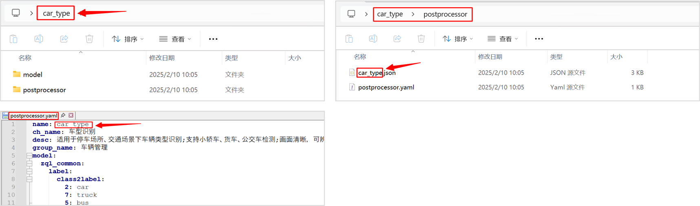
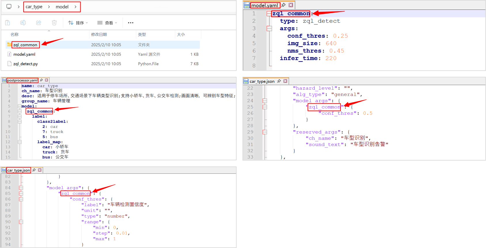
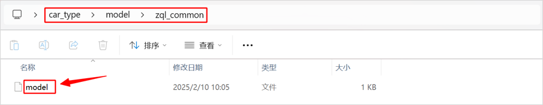
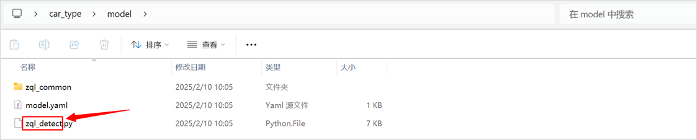
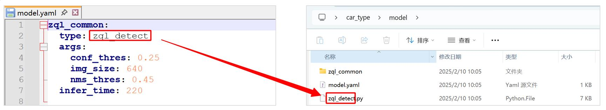
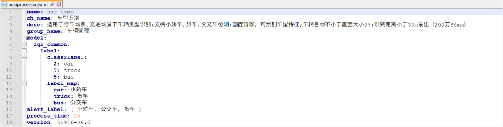
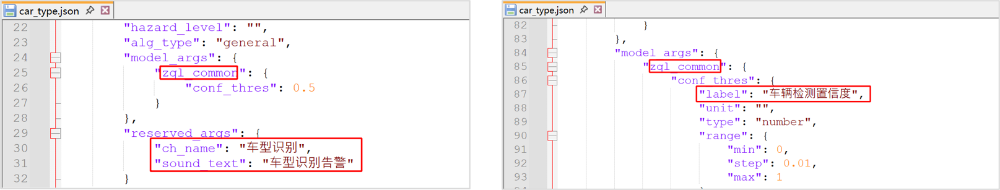

# quick_start 

## 1. 下载示例算法包

```
git clone https://github.com/AIDrive-Research/Custom-Algorithm.git
```

下载示例算法包，并在示例算法包上修改。

- 如果产品型号为ks968，则在ks968下的[car_type](../../02_Demo/AlgorithmPackage/ks968/car_type)算法包上修改。
- 如果产品型号为ks988，则在ks988下的[car_type](../../02_Demo/AlgorithmPackage/ks988/car_type)算法包上修改。

产品型号查看，产品型号在【系统设置】-【设备升级】中可查看。


**本文以ks968算法包制作为例。**

## 2. 模型训练

模型训练参照yolov5训练[文档](../../../01_ModelTraining/01_Detection/Yolov5/README.md)，训练完成后导出onnx模型并量化，量化完成后得到rknn模型。

## 3. 配置文件修改

修改算法包的如下配置项。

| 修改项             | 详情                                                         |
| ------------------ | ------------------------------------------------------------ |
| 算法名称           | 算法包文件夹名称、后处理代码文件名称、后处理json文件名称以及postprocessor.yaml中的name需要保持一致。新算法名称不得与已有算法名称重复。 |
| 模型名称           | 模型文件夹名称、model.yaml中的模型名称、postprocessor.yaml中的模型名称、xxx.json中的模型名称需保持一致。新模型名称不得与已有模型名称重复。 |
| 模型文件           | 模型文件夹下的模型，统一命名model（不要命名为model.rknn）    |
| 模型类型           | model文件夹下的.py文件为模型类型，新模型类型不得与已有模型类型重复。 |
| model.yaml         | 修改模型名称、检测类型（模型名称）、输入参数、推理时间。     |
| postprocessor.yaml | 修改算法中英文名称、算法描述、分组类别、模型配置。           |
| xxx.json           | 修改json文件中的模型名称、算法名称、语音文本等内容。         |

- **算法名称修改**。修改为自己定义的算法名称，如：custom_car_type，若不修改，会覆盖已有算法文件。



- **模型名称修改**。修改为自定义的模型名称，如custom_common，若不修改，会覆盖已有模型。



- **模型文件修改**。量化后的模型文件统一命名为model，如下图所示，不可命名为model.rknn。



- **模型类型修改**。模型类型为推理代码文件名称，修改为自定义名称。如custom_detect.py。



- **model.yaml文件修改**。第1行是模型名称，第2行模型类型是推理代码的名称，第4行-第6行是模型输入参数。第7行是模型推理时间，其设置应当保证source队列没有积压，若队列存在积压，则增加推理时间。  
若[转换模型](../../../01_ModelTraining/01_Detection/Yolov5/README.md)的anchors不是通用anchors，需在args下增加anchors参数。
    ```
    zql_common:
    type: zql_detect
    args:
        conf_thres: 0.25
        img_size: 640
        nms_thres: 0.45
        anchors: [[10, 13], [16, 30], [33, 23], [30, 61], [62, 45], [59, 119], [116, 90], [156, 198], [373, 326]]
    infer_time: 60
    ```


- **postprocessor.yaml文件修改**。第1行是算法名称，第2行是算法中文名称，第3行是算法描述，第4行是算法组类别，第6行至第15行是模型参数，第16行是告警label，从label_map中的value中进行选择。第17行为后处理时间，其设置应当保证engine队列没有积压，若队列存在积压，则增加处理时间。



- **前端配置文件xxx.json修改**。详细可参照[前端配置说明](../../03_PackageStructure/README.md)。修改模型名称、算法名称、语音播报内容、置信度label等。



## 4. 算法包加密与导入

- 将算法包加密为bin文件。下载算法包[加密工具](../../../Tools/ks-tools/ks-tools.zip)。将待加密算法包放在文件夹内（文件夹只含单个算法包），填写待加密算法包的上级路径（如下述文件夹所示），点击【确定】按钮，提示即将加密的算法包名称，点击【ok】；


- 加密完成的bin文件为最终文件，从盒子后台管理系统【算法仓库】中导入即可。 


## 5. 代码调试

- 在下图所示红色框内，连续点击7次，打开开发者模式


- 在高级设置，终端管理中，可进入盒子后台调试&查看日志（请勿删除系统源码，谨慎操作，否则造成设备不可用）


- 调试代码。导入`logger`包，使用`LOGGER.info`输出日志。示例如下。

```python
from logger import LOGGER

LOGGER.info('boxes:{},classes:{},scores:{}'.format(boxes, classes, scores))
```

-  查看日志

查看推理模块日志

```bash
tail -f ks/ks968/data/logs/engine/0/engine.log
```

查看后处理模块日志

```bash
tail -f ks/ks968/data/logs/filter/filter.log
```