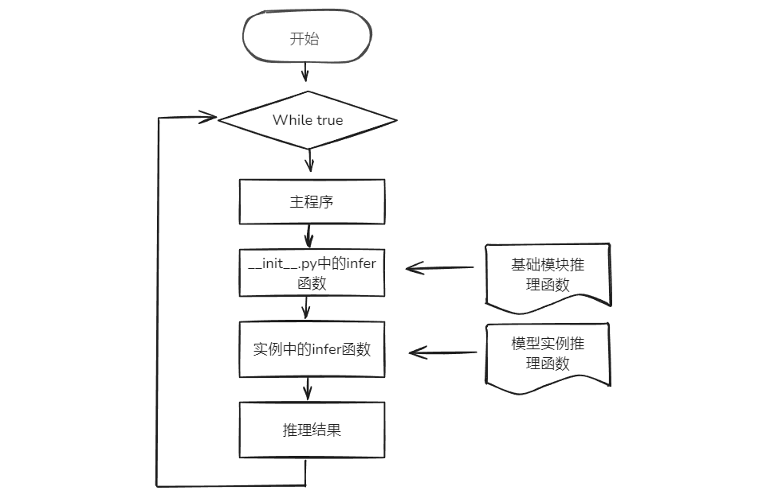
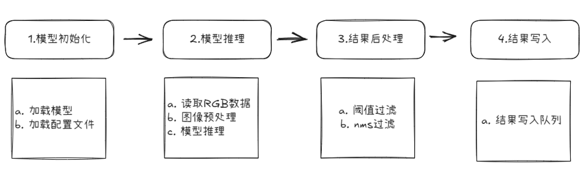
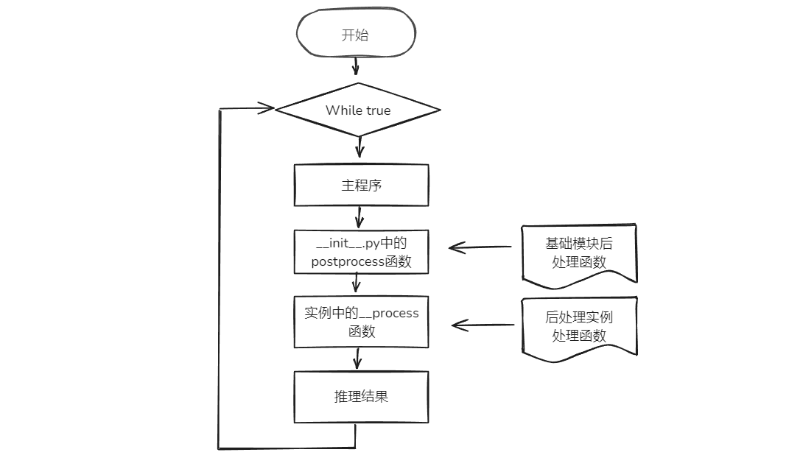
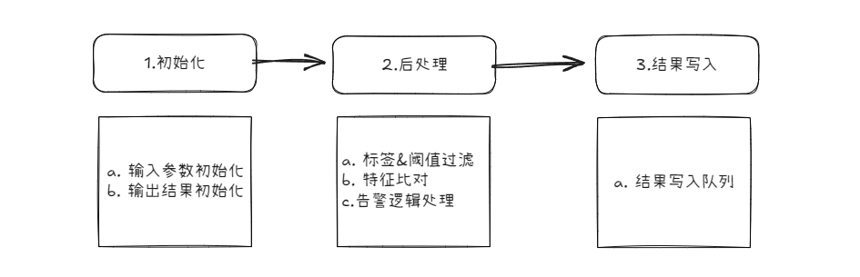

# 03_PackageStructure

## 模块结构概述
本模块主要包含以下两部分内容：
- model（推理模块）
    - 配置文件说明：详细介绍推理模块需要修改的配置文件及其具体内容。
    - 核心代码说明：深入讲解推理代码的实现逻辑及使用方法。
- postprocessor（后处理模块）
    - 配置文件说明：详细介绍后处理模块需要修改的配置文件及其具体内容。
    - 核心代码说明：深入讲解后处理代码的实现逻辑及使用方法。

### model
推理模块负责加载模型、执行前向推理，并输出检测结果。

**1. 模型文件夹**：[zql_person](./work_clothes/model/zql_person)，[zql_work_clothes](./work_clothes/model/zql_work_clothes)  
存放01_ModelTraining阶段生成的模型文件，模型文件统一命名为<span style="color:red;"> model </span>。

**2. 推理代码**：[zql_detect.py](./work_clothes/model/zql_detect.py)，[zql_arcface.py](./work_clothes/model/zql_arcface.py)  

推理模块调用流程图


主程序循环调用`__init__.py`中的`infer`函数，该函数在每个实例中会被重写。

下图为推理模块流程图。

- **模型初始化：** 加载模型，加载模型配置文件。
- **模型推理：** 读取RGB图像，进行图像缩放、维度变换等预处理，并进行模型推理。
- **结果后处理：** 执行阈值过滤与nms过滤等操作，对低阈值目标，重复目标进行过滤。
- **结果写入：** 推理结果写入redis队列。



以**未穿工服检测算法**为例进行说明。算法使用`yolov5`，检测人员目标，目标检测推理代码[`zql_detect.py`](./work_clothes/model/zql_detect.py)。

**核心函数：infer**

#### 函数输入

- `data：`RGB图像数据
- `**kwargs：`用户自定义k-v参数对

#### 函数输出

- `infer_result`，格式如下。

```python
[
    {
        "conf": 0.38,
        "label": 0,
        "xyxy": [314, 93, 435, 142]
    }, {
        "conf": 0.36,
        "label": 0,
        "xyxy": [538, 258, 553, 269]
    }
]
```

#### 处理过程

- `self._letterbox():` 对输入图像进行填充缩放。
- `self._rknn_infer():` rknn模型推理。
- `self.__yolov5_post_process():` 对rknn推理结果进行目标框、类别、置信度解码；过滤低置信度目标；非极大值抑制去除冗余目标。

**3. 模型配置文件**：[model.yaml](./work_clothes/model/model.yaml) 
```bash
zql_person:              # 模型名称：model内模型文件夹名字，必填
  type: zql_detect       # 模型对应的推理代码，必填
  args:                  # 模型推理默认参数，必填
    conf_thres: 0.25     # 模型参数，非必填
    img_size: 640
    nms_thres: 0.45
  infer_time: 60         # 推理时间，必填

zql_work_clothes:        # 模型名称：model内模型文件夹名字，必填
  type: zql_arcface      # 模型对应的推理代码，必填
  args:                  # 模型推理默认参数，必填
    img_size: 256        # 模型参数，非必填
  infer_time: 150        # 推理时间，必填
```

### postprocessor（后处理模块）
后处理模块负责解析推理输出、筛选目标并生成最终检测结果。 

**1. 后处理代码**：[worch_clothes.py](./work_clothes/postprocessor/work_clothes.py)
后处理模块调用流程图


主程序循环调用`__init__.py`中的`postprocess`函数，该函数会调用每个后处理实例中的`__process`函数。

下图为后处理模块流程图。

- **初始化：** 后处理的输入参数与输出结果初始化。
- **后处理：** 过滤非标签目标，过滤低置信度目标，特征比对，告警业务逻辑编写。
- **结果写入：** 结果写入告警队列。



**核心函数：__process**

#### 函数输入

- `result：`结果字典。包括是否命中`hit`，以及告警结果数据`data`。
    - 若后处理产生告警，则`hit`为`true`，否则为`false`。
    - `data`中：
        - `bbox`包含：`rectangles`为目标框数据，`polygons`为多边形检测区域数据，`lines`为虚拟直线数据。
        - `custom`为用户自定义的数据。
        - `group`为底库组，`id`为组id，`name`为组名字。

```json
{
	"hit": true,
	"data": {
		"bbox": {
			"rectangles": [{
				"xyxy": [1066, 124, 1164, 270],
				"color": [0, 0, 255],
				"label": "未穿工服",
				"conf": "None",
				"ext": {}
			}],
			"polygons": {
				"polygon_073c09e1-515e-47c9-89e0-52fa69811b46": {
					"name": "",
					"polygon": [
						[1, 715],
						[6, 1],
						[1273, 6],
						[1275, 716]
					],
					"color": [255, 0, 0],
					"ext": {}
				}
			},
			"lines": {}
		},
		"custom": {},
		"group": {
			"id": "675801d85dc58a0a16073339",
			"name": "红色工服底库"
		}
	}
}
```

- `filter_result`：标签过滤以及低置信度过滤后的结果。`person`指的是模型名称，后面的值是模型的推理结果list。
- 第一次推理，人体检测的`filter_result`。

```json
{
	"work_clothes": [],
	"person": [{
		"xyxy": [1066, 124, 1164, 268],
		"color": [0, 255, 0],
		"label": "person",
		"conf": 0.9,
		"ext": {}
	}]
}
```

- 第二次推理，特征提取的`filter_result`。`feature`为512维工服特征。

```json
{
	"work_clothes": [{
		"feature": [-0.08117731660604477, 0.0363161638379097,...]
	}]
}
```

#### 函数输出
`True` or `False`


**2. 算法配置文件**：[postprocessor.yaml](./work_clothes/postprocessor/postprocessor.yaml)

```bash
name: work_clothes            # 算法名称，算法包最外层文件夹名称，必填
ch_name: 未穿工服检测          # 算法中文名称，必填
desc: 适用于工地、工厂未穿工服检测;需配置工服底库并载入底库;底库需具备不同距离、姿态、光线多样性;画面可分辨人员及工服特征;人员及工服目标不小于画面大小5%;识别距离小于20m最佳（200万@6mm） # 算法说明，必填
group_name: 人员管理           # 算法分组，对应算法仓库分组名称
model:                        # 模型参数，必填
  zql_work_clothes:           # 模型名称，model内模型文件夹名字
    inactive: true            # 不需要全图推理时使用该参数，在后处理的reinfer中自定义二阶段推理
    label:                    # label，必填
      class2label:            # 类别对应的英文名称
        0: work_clothes
      label2map:              # 英文名称对应的显示名称
        work_clothes: 未穿工服
  zql_person:                 # 模型名称，model内模型文件夹名字
    label:
      class2label:
        0: person
alert_label: []               # 告警类别，在检测到目标即告警的算法中，无需后处理文件时该项必填。在有后处理文件时，告警类别可在后处理文件中定义。
process_time: 10              # 后处理时间，必填
version: ks968-v9.0           # 适配的晓知精灵型号-算法版本，必填
```

**3. 前端配置文件**：[worch_clothes.json](./work_clothes/postprocessor/work_clothes.json)

配置文件内容包含两部分：`basicParams`和`renderParams`。

#### basicParams 

`basicParams`提供了在数据源中绑定算法时所需要用到的算法参数格式以及部分参数的默认值，在`添加数据源`和`编辑数据源`这两接口中`basicParams`的内容会被拷贝到`alg`字段中，其格式如下：

```
"alg": {
    "算法名称": "basicParams内容"
}
```

`basicParams`格式及内容如下：

```
{
    "alert_window": {
        "type": "interval_threshold_window",
        "interval": 5,
        "length": 5,
        "threshold": 3
    },
    "bbox": {
        "polygons": [],
        "lines": []
    },
    "plan": {
        "1": [[0, 86399]],
        "2": [[0, 86399]],
        "3": [[0, 86399]],
        "4": [[0, 86399]],
        "5": [[0, 86399]],
        "6": [[0, 86399]],
        "7": [[0, 86399]]
    },
    "hazard_level": "",
    "alg_type": "general",
    "model_args": {
        "reflective_vest": {
            "conf_thres": 0.3
        },
        "person": {
            "conf_thres": 0.85
        }
    },
    "reserved_args": {
        "ch_name": "未穿戴反光衣检测",
        "sound_text": "未穿戴反光衣检测告警"
    }
}
```

`basicParams`内容分为7个模块：`alert_window`、`bbox`、`plan`、`hazard_level`、`alg_type`、`model_args`、`reserved_args`，这7个模块必须存在，用户可根据需求自行修改模块中参数的值。若用户需要添加一些自定义参数，可以在`reserved_args`模块中添加。

##### alert_window

`alert_window`定义了告警触发的窗口类型，其中`type`字段定义了窗口的类型，不同类型的窗口拥有不同的参数种类，目前支持2种窗口类型：

###### interval_threshold_window

* `length`，窗口的长度（次）。
* `threshold`，窗口触发阈值（次），应小于等于`length`。
* `interval`，两次告警之间最短时间间隔（秒）。

当`length`/`threshold`的值分别为`3`/`2`时，窗口的语义为：连续3次检测中命中了2次或以上，则产生一个告警。

`interval`参数，用于控制告警频率，单位是秒。

当`length`/`threshold`/`interval`的值分别为`3`/`2`/`5`时，窗口的语义为：连续3次检测中命中了2次或以上，则产生一个告警，在上报一个告警之后的5秒内所产生的新的告警将不会上报。

适用于大多数的算法。

###### interval_duration_window

* `duration`，窗口长度（秒）。
* `interval`，两次告警之间最短时间间隔（秒）。

当`duration`/`interval`的值分别为`10`/`20`时，窗口的语义为：在连续10秒内所有的检测全部命中，则产生一个告警，在上报一个告警之后的20秒内所产生的新的告警将不会上报。

适用于部分需要通过一段时间的连续触发来判定告警的算法，如：离岗检测。

##### bbox

`bbox`定义了用户在捕获的数据源图片中可编辑的几何形状，这些几何形状可参与算法后处理的逻辑判断，同时也可以在告警图片以及实时画面中显示出来，目前支持2种类型的几何图形：

###### polygons（多边形）

支持多个多边形并存，通过`list`结构保存，每个多边形的数据结构如下：

```
{
    "id": "27d590b2-3bc4-4bfb",
    "name": "test",
    "polygon": [
        [391, 598],
        [403, 451],
        [711, 440],
        [650, 591]
    ]
}
```

其中`id`表示多边形的`id`，须具备唯一属性（通常使用`uuid`即可）；`name`即多边形的名称，若`name`不为空，则会在实时画面以及告警图片中显示出来；`polygon`即多边形的顶点坐标，顶点数量不得小于3。

###### lines（线段）

支持多个线段并存，通过`list`结构保存，每个线段的数据结构如下：

```
{
    "id": "27d590b2-3bc4-4bfb",
    "name": "test",
    "line": [
        [391, 598],
        [403, 451]
    ]
}
```

其中`id`表示线段的`id`，须具备唯一属性（通常使用`uuid`即可）；`name`即线段的名称，若`name`不为空，则会在实时画面以及告警图片中显示出来；`line`即线段的端点坐标，端点数量为2。

##### plan

`plan`用于定义算法的布控时间计划，只有在布控计划范围之内产生的告警才会上报，`plan`的数据格式为`k-v`对，其中`key`（字符串类型）：`1~7`表示：`星期一~星期日`；`value`为`list`格式，每个元素表示一天中的一个时间段，取值范围：`0~86399`（秒）。

##### hazard_level

`hazard_level`用于定义告警的`危险等级`，格式为字符串，触发告警后告警报文以及告警图片中会携带`危险等级`。

##### alg_type

`alg_type`定义了算法的类型，不同类型的算法其后处理流程不一样，目前支持7种算法类型：

* `general`，通用类型，适用于大部分算法。

* `counting`，计数类型，此类算法会在告警报文、告警结果、实时画面中罗列出指定区域的计数统计结果，适用算法如人员聚集、值岗检测等。

* `cross_line_counting`，跨线计数类型，当检测目标从标定的线段一侧跨越到另一侧时触发计数，此类算法会在告警报文、告警结果、实时画面中罗列出指定线段的计数统计结果，适用算法如：人员计数、车辆计数等。注意：计数类算法搭配`interval_threshold_window`使用，需设置`length`、`threshold`、`interval`为1，1，0。

* `match_face`，人脸匹配类型，此类算法在配置时需要选择人脸底库，并且会在告警报文、告警结果中将检测到的人脸图像及其命中的底库人脸图像罗列出来，适用算法：人脸检测。

* `match_work_clothes`，工服匹配类型，此类算法在配置时需要选择工服底库，适用算法：未穿戴工服检测。

* `match_ppe`，`ppe`匹配类型，此类算法在配置时需要选择`ppe`底库，适用算法：未佩戴护目镜检测、未戴手套检测、未穿工装鞋检测等。

* `match_open_lib`，`open_lib`匹配类型，此类算法在配置时需要选择`open_lib`底库，适用算法：消防通道占用检测。

##### model_args

`model_args`定义了算法所用到的模型的参数，比如未穿戴反光衣检测算法可配置人体模型置信度以及反光衣模型置信度，数据结构如下：

```
"model_args": {
    "reflective_vest": {
        "conf_thres": 0.3
    },
    "person": {
        "conf_thres": 0.85
    }
}
```

##### reserved_args

`reserved_args`主要用于定义用户的自定义字段，这些字段及其值可以被传输到后处理逻辑里面，用于用户编写自己的算法逻辑。下表中列举了`reserved_args`中的常用参数以及一些特殊参数的说明：

|                    算法                    |    参数     |                             说明                             |
| :----------------------------------------: | :---------: | :----------------------------------------------------------: |
|                  所有算法                  |   ch_name   |                         算法中文名称                         |
|                  所有算法                  | sound_text  |                       算法语音报警文本                       |
|             徘徊检测、睡岗检测             |   length    | 后处理逻辑中所用到的参数，并非告警窗口的`length`参数，但是为了便于用户理解，界面上将其显示在“告警窗口长度”属性中。 |
|             徘徊检测、睡岗检测             |  threshold  | 后处理逻辑中所用到的参数，并非告警窗口的`threshold`参数，但是为了便于用户理解，界面上将其显示在“告警阈值”属性中。 |
| 抽烟检测、使用手机检测等需要二次推理的算法 | extra_model | 二次推理模型配置，比如抽烟检测算法需要先检测人体，然后再将人体抠图输入到抽烟模型里面执行二次推理，用以提高准确率，在这里`"extra_model": {"smoke": 3}`表示最多执行3次二次推理，即一张图中最多只识别3个抽烟的人 |

#### renderParams

`renderParams`部分的内容分为4个模块：`alert_window`、`bbox`、`model_args`、`reserved_args`，分别用于渲染`basicParams`部分与之对应的模块，`renderParams`的格式如下：

```
{
    "alert_window": {
        "interval": {
            "label": "告警间隔",
            "unit": "秒",
            "tooltip": "例：设置为5秒，则5秒内连续检测到多次只告警1次",
            "type": "number",
            "range": {
                "min": 0,
                "step": 1,
                "max": 99999999
            }
        },
        "length": {
            "label": "告警窗口长度",
            "unit": "次",
            "tooltip": "告警事件的判断周期，如设置5，则利用最近的5次检测结果判断是否为告警。",
            "type": "number",
            "range": {
                "min": 0,
                "step": 1,
                "max": 100
            }
        },
        "threshold": {
            "label": "告警阈值",
            "unit": "次",
            "tooltip": "告警命中阈值，配合告警窗口使用。如告警窗口长度设置为5，告警阈值设置为3，则5次检测结果中，有3次告警命中，为1次告警事件。",
            "type": "number",
            "range": {
                "min": 0,
                "step": 1,
                "max": 100
            }
        }
    },
    "reserved_args": {
        "threshold": {
            "label": "人员密度",
            "unit": "人",
            "tooltip": "检测区域内人员数量大于等于阈值n产生告警。如n=2，表示检测区域内人员数量大于等于2人产生告警。",
            "type": "number",
            "range": {
                "min": 2,
                "step": 1,
                "max": 99999999
            }
        },
        "strategy": {
        	"hide": true,
            "label": "检测策略",
            "tooltip": "检测框判断点选择。如选择底部，表示利用检测框底部中点与区域（如入侵区域或离岗区域）关系判断告警事件。",
            "type": "select",
            "options": [{
                    "label": "顶部",
                    "value": "top"
                }, {
                    "label": "中心",
                    "value": "center"
                }, {
                    "label": "底部",
                    "value": "bottom"
                }, {
                    "label": "左侧",
                    "value": "left"
                }, {
                    "label": "右侧",
                    "value": "right"
                }
            ]
        },
        "sound_text": {
            "label": "浏览器语音播报",
            "type": "text",
            "maxLength": 20
        }
    },
    "bbox": {
        "polygons": {
            "exists": "must",
            "max": -1,
            "edge": -1
        },
        "lines": {
            "exists": "must",
            "max": -1,
            "cross": true
        }
    },
    "model_args": {
        "reflective_vest": {
            "conf_thres": {
                "label": "反光衣检测置信度",
                "unit": "",
                "type": "number",
                "range": {
                    "min": 0,
                    "step": 0.1,
                    "max": 1
                }
            }
        },
        "person": {
            "conf_thres": {
                "label": "人体检测置信度",
                "unit": "",
                "type": "number",
                "range": {
                    "min": 0,
                    "step": 0.1,
                    "max": 1
                }
            }
        }
    }
}
```
##### alert_window

`alert_window`用于渲染`basicParams`的`alert_window`模块，使用方法即字面意思，需要注意的是`type`字段，`type`字段的可选值：`number`/`select`/`text`。

* `number`，当`type`为`number`时需要配置`range`，`range`中需包含`min、max、step`这3个字段，参考示例`json`。
* `select`，当`type`为`select`时需要配置`options`，参考示例`json`。
* `text`，当`type`为`text`时需要配置`maxLength`，参考示例`json`。

##### bbox

`bbox`用于渲染`basicParams`的`bbox`模块。

###### polygons

* `exists`，可选值：`must`/`optional`，`must`表示必须画多边形，`optional`可画可不画多边形。
* `max`，表示最大可画多边形的数量，`-1`表示不限制数量，`1`表示最多只能画一个多边形。
* `edge`，表示边形边的数量，`-1`表示不做限制，`3`表示只能画三角形，以此类推。

###### lines

* `exists`，可选值：`must`/`optional`，`must`表示必须画线段，`optional`可画可不画线段。

* `max`，表示最大可画线段的数量，`-1`表示不限制数量，`1`表示最多只能画一个线段。

* `cross`，可选值`true`/`false`，`false`表示非跨线类线段（即普通线段）；`true`表示跨线类线段，适用算法如：人员计数、车辆技术等，这类线段会有一些额外的属性，数据结构如下：

  ```
  {
      "lines": [{
              "id": "3a318723-46b9-430e-9d6d-cb4a697edc60",
              "line": [[215, 473], [881, 190]],
              "direction": "l+r-",
              "name": "test",
              "action": {
                  "increase": "进入",
                  "decrease": "离开",
                  "delta": "净增"
              }
          }, {
              "id": "2a140131-86f1-4cba-b0f4-fe6460dcf6a9",
              "line": [[205, 243], [640, 118]],
              "direction": "r+",
              "name": "test1",
              "action": {
                  "count": "统计"
              }
          }
      ]
  }
  ```
  * `direction`表示跨线的方向，支持以下几种跨线方式：`l+`/`r+`/`u+`/`d+`/`l+r-`/`r+l-`/`u+d-`/`d+u-`，其中，`r+`表示从左到右跨线时计数统计加1；`l+`表示从右到左跨线时计数统计加1；`u+d-`表示从下到上跨线计数统计加1，从上到下跨线时技术统计减1；以此类推。
  * `action`定义了跨线行为的字面描述，当`direction`为`l+`/`r+`/`u+`/`d+`中的一种时，可选属性为`count`，表示计数统计结果；当`direction`为`l+r-`/`r+l-`/`u+d-`/`d+u-`中的一种时，可选属性为`increase`/`decrease`/`delta`，`increase`的值会在触发加1行为时加1，`decrease`的值会在触发减1行为时加1，`delta`的值为`increase - decrease`，表示最终的净增值。

##### model_args

`model_args`用于渲染`basicParams`的`model_args`模块，使用方法即字面意思，需要注意的是`type`字段，`type`字段的可选值：`number`/`select`/`text`。

* `number`，当`type`为`number`时需要配置`range`，`range`中需包含`min、max、step`这3个字段，参考示例`json`。
* `select`，当`type`为`select`时需要配置`options`，参考示例`json`。
* `text`，当`type`为`text`时需要配置`maxLength`，参考示例`json`。

##### reserved_args

`reserved_args`用于渲染`basicParams`的`reserved_args`模块，使用方法即字面意思，需要注意的是`type`字段，`type`字段的可选值：`number`/`select`/`text`。

* `hide`，当需要将此对象隐藏到`高级设置`中时，可以将`hide`的值置为`true`，默认为`false`即不隐藏。
* `number`，当`type`为`number`时需要配置`range`，`range`中需包含`min、max、step`这3个字段，参考示例`json`。
* `select`，当`type`为`select`时需要配置`options`，参考示例`json`。
* `text`，当`type`为`text`时需要配置`maxLength`，参考示例`json`。


