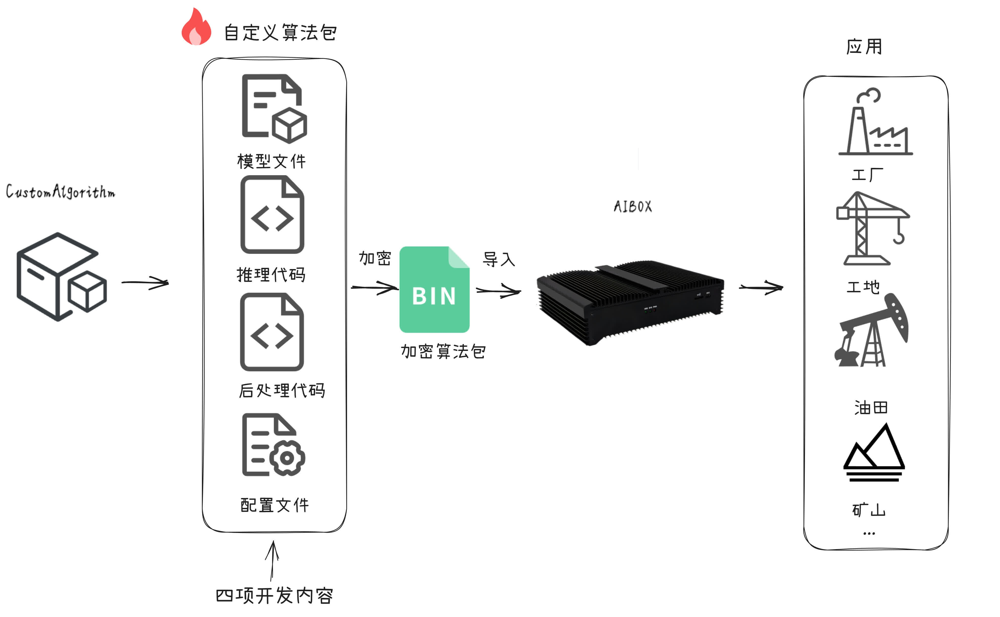

# CustomAlgorithm

## 🚀工作示意图



只需关注推理模块与后处理模块，按需开发算法模型与业务逻辑。

## 📂目录结构

### 01_Examples: 多种算法逻辑实现样例
- 提供不同功能算法的代码示例，帮助用户根据具体需求进行算法定制。
### 02_Demo: 晓知精灵标配算法包、开发套件参考样例
- AlgorithmPackage: 包含ks968和ks988两种型号，40种算法包样例，可供参考。
- DevelopmentKit: 包含推理模块和后处理模块参考样例。
### 03_PackageStructure: 算法包详解
- 结构样例：展示如何组织算法包的文件结构，便于理解和定制。
- 参数详解：详细说明算法包中的配置参数，便于自定义调整。

## 自定义算法包流程
### 1. 确定任务类型
- 根据业务需求，参考[01_Examples](./01_Examples)，选择一种参考样例。
### 2. 推理代码实现
- 若自定义算法包所需模型在[01_ModelTraining](../01_ModelTraining)提供的模型样例中，则无需编写推理代码。
- 若所用模型未在[01_ModelTraining](../01_ModelTraining)中提供，参考[02_Demo/DevelopmentKit/model](./02_Demo/DevelopmentKit/model)编写推理代码。
### 3. 后处理代码实现
- 根据参考样例，调整后处理代码逻辑。
### 4. 算法包配置
- 参考[03_PackageStructure](./03_PackageStructure)中算法包参数详细说明，修改自定义算法包配置文件参数。
### 5. 算法包加密
- 使用[Tools/ks-tools](../Tools/ks-tools)对算法包加密，生成bin文件。
### 6. 导入算法仓库、添加算法、调试
- 在下图所示红色框内，连续点击7次，打开开发者模式


- 在高级设置，终端管理中，可进入盒子后台调试&查看日志（请勿删除系统源码，谨慎操作，否则造成设备不可用）


- 调试代码。导入`logger`包，使用`LOGGER.info`输出日志。示例如下。

```python
from logger import LOGGER

LOGGER.info('boxes:{},classes:{},scores:{}'.format(boxes, classes, scores))
```

-  查看日志

查看推理模块日志

```bash
tail -f ks/ks968/data/logs/engine/0/engine.log
```

查看后处理模块日志

```bash
tail -f ks/ks968/data/logs/filter/filter.log
```
